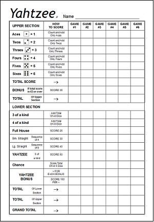

# Refactoring

This is a repository in which I will make an execrsie of refactoring in python. There is a base functions and each test case, and I will have to refactor it to make the code easier to read, trying to follow the **SRP** and **OCP** **SOLID principles** and **Test Driven Development (TDD)**.

This exercise is took from the book *The Coding Dojo Handbook, a practical guide to creating a space where good programmers can become great programmer* by Emily Bache. Link to her github and kata: [Yatzy-Refactoring-Kata](https://github.com/emilybache/Yatzy-Refactoring-Kata).

The starting structure of the program is based on the sample of my teacher David Gelpi. His github: [dfleta/Yatzi_Refactoring_TDD_Kata](https://github.com/dfleta/Python_ejercicios/tree/master/Poo/Yatzy_Refactoring_TDD_Kata)

This program is based on the game called "yatzy" and it is constructed by a class and their methods and their test cases.

First, we will make a small description on how the game works and the we will start making new test cases. Then, trying to implement TDD we will start coding to pass those test. After this, we will start refactoring each method till we consider it is fully done.

## Yatzy

Yatzy is a dice game which has similarities with the English game called poker dice. There are a lot of different types of yatzy, so you may find an other type of score table, in which other categories are included.

## Basic information

---

To play yatzy we need 5 dice and a table like the following:

This board has two parts in which you have to place the score earned throwing the dice at each turn.

## Gameplay

It consists in throwing five dice and trying to reach the highest score posible. Every turn has 2 parts:

1. You have 3 different tries to throw the dices and select the one that is going to give you the highest score.

2. You have to choose where are you going to place each score.

## Scoring

As we could see at the picture of the score table, there are two sections in the table. The upper section in which we will count the number of dice that are repeated. Example: (1-1-1-2-3) We will count 1 x 3 = 3 points. If the player reach 63 or more points in the upper section, the game gives their 50 points additional.

There is a lower section in which the rules change and the score method is similar to poker. There are different ways to score:

* 1 pair:  the player score the highest sum of the number paired
* 2 pairs:  the player score the sum of the double paired number
* Three of a kind: the player scores the sum of the values of all dice repeated
* Four of a kind: the player scores the sum of the values of all dice dice repeated
* Full-house: the player scores the sum of the values of all dice if there are 2 dice with the same value and other 3 with a differente value but also repeated (2,2,3,3,3)
* Small straight: the player scores 30 if there is a smal straight (1,2,3,4,5)
* Large straight: the player scores 20 if there is a large straight (2,3,4,5,6)
* Yatzy: the player scores 50 points if there is 5 values repeated or adds a (x) at yatzy bonuses if already filled.

There is also a category in which you can save your dive value sum in case you do not want to save it in any other category that is called "chance"

The player that get the highest score after filling all the sections, wins!!

## Turn sample

This is going to be an example of a turn in the game, so you can play too and understand better what we will be working on.

* The player throws 5 dive and select their best combination (5-5-5-2-1). We choose the three 5 and throw again till we waste or not our 3 turns.  

* We finally get (5-5-5-5-1) and we got four 5, so we decided that is better for us to get this score at the lower section in which we get the sum of the 5 dive that is = 21 points.  

* After this the turn ends and we have to repeat this till all the secion is filled.
